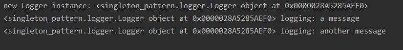

# Design Patterns
## Contents
[Why use design patterns?](#why-use-design-patterns)

[Creational Design Patterns](#creational)
- [Singleton](#singleton)

[Structural Design Patterns](#structural)


[Behavioural Design Patterns](#behavioural)

## Why use design patterns?
Design patterns can help us to write code in a more readable and maintainable way. When it
comes to python, they can also help us write in a more '*pythonic*' way and stick to the 
'*Zen of Python*' to write code which is both elegant and useful.

```
The Zen of Python, by Tim Peters

Beautiful is better than ugly.
Explicit is better than implicit.
Simple is better than complex.
Complex is better than complicated.
Flat is better than nested.
Sparse is better than dense.
Readability counts.
Special cases aren't special enough to break the rules.
Although practicality beats purity.
Errors should never pass silently.
Unless explicitly silenced.
In the face of ambiguity, refuse the temptation to guess.
There should be one-- and preferably only one --obvious way to do it.
Although that way may not be obvious at first unless you're Dutch.
Now is better than never.
Although never is often better than *right* now.
If the implementation is hard to explain, it's a bad idea.
If the implementation is easy to explain, it may be a good idea.
Namespaces are one honking great idea -- let's do more of those!
```

## Creational
### Singleton
[[code](singleton_pattern)]

My implementation of this pattern contains a singleton class `Logger` and a couple of
classes which use it, `Usage` and `Another Usage`. To test that only one instance was 
being made I added some print statements. This was the result, showing only one instance of
`Logger` being created, and that same instance being used to log.



#### What is it?
A class which can only have one instance.

#### When is it useful?
An application needs only one instance of an object which can be globally accessed.

A common use for the singleton pattern is for logging. Often you want one instance
of the logging class in your program, but wish to use it throughout. Therefore you
benefit from having a global single instance of this class. You can see this example
implemented in the code

#### When is it *not* useful?
It shouldn't be used as a global variable. Whilst it acts a bit like one, you should really be asking yourself
> Why do I want to make this thing global?

Not 
> How can I make this thing global?

This is a code smell, implying bad design. 

This pattern is also not necessarily appropriate in multithreaded programs which are asynchronous,
it could still create multiple instances.

### Builder
[[code](builder)]

#### What is it?
The builder pattern is a way of separating the construction of a complex object from the rest of the class.

#### When is it useful?
It is often used when a constructor would require a lot of arguments, especially if they are of the same type.
It is easy to forget the order in which you need to provide the arguments, meaning it won't fail during compilation
but you are likely to get a runtime error. It is also hard to understand when there are many arguments and you
don't remember what they all are.

Another situation is when you have some parameters which are optional, this can add more complexity to a task 
as you may require additional constructors. One way to solve this would be to have setters, but if they have 
a particular order or compulsory parameters then you could end up with an object which is only half constructed 
or constructed in an incompatible way.

#### When is it *not* useful?
One drawback of the builder pattern is that it adds a lot more code to the solution. Sometimes it just isn't
necessary. However if you are writing code which is going to be read a lot by others and needs to be maintained
I think is is worth it.


[[Back To Top](#design-patterns)]
## Structural


[[Back To Top](#design-patterns)]
## Behavioural


[[Back To Top](#design-patterns)]

# References/further reading
[source making](https://sourcemaking.com/design_patterns) contains a good reference for many design patterns

[geeks for geeks](https://www.geeksforgeeks.org/software-design-patterns/) had some good base knowledge, as well as 
example implementations of many patterns

[toptal](https://www.toptal.com/python/python-design-patterns) has useful python implementations of design patterns
(most I found were in Java)

[[Back To Top](#design-patterns)]